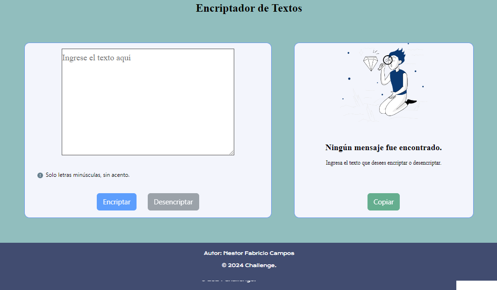
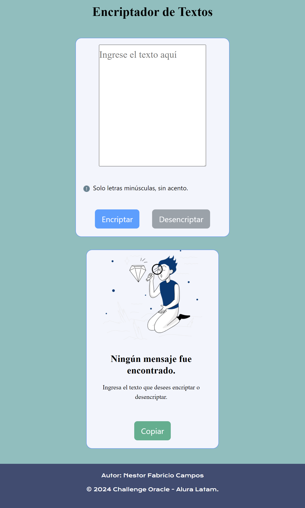
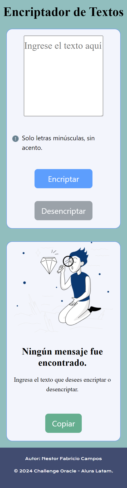

<h1 align="center"> Challenge - Encriptador de Texto </h1>

   
   

   
   

<h1>Descripción del Proyecto</h1>

El Proyecto Encriptador de Texto se encientra en face de desarrollo, el mismo cuenta con una funcionalidad que permitirá ingresar texto
y luego se puede encriptar el texto ingresado, transformándolo en una cadena ilegible. Posteriormente se podrá desencriptar este texo y
y volver a mostrar por pantalla el texto original ingresado al principio.

<h4 align="center">
:construction: Proyecto en construcción :construction:
</h4>

<h1>Tecnologías utilizadas</h1>
<ul>
  <li>HTML</li>
  <li>Javasript</li>
  <li>Bootstrap</li>
  <li>CSS</li>
</ul>

<h1>Finalización del Proyecto</h1>

Se finaliza el desarrollo del Proyecto, el usuario puede insertar un texto que puede ser encriptado o desencriptado, y puede escojer cualquiera de las dos opciones.

El mismo posee la funcionalidad de ser responsivo y puede ser visualizado correctamente en dispositivos móviles, 
tablets, laptops y compuadoras de escritorio. Se adjuntan capturas de pantalla del Encriptador de Texto.

<h2>Despliegue</h2>

Se ofrcen capturas de pantalla de las diferentes visualizaciones del Proyecto.

<h2 align= center>Desktop</h2>

<h2 align= center>Tablet</h2>

<h2 align= center>Dispositivo móvil</h2>

   
   

<h1>Acceso al proyecto en la web</h1>
<a href="https://nestorfabriciocampos.github.io/Challenge-EncriptadorTexto">Encriptador de Texto</a>

